# GMMIvector 教程
## 开始之前
理论部分：
+ __明确一点__ ：该实验为文本相关的基于ivector的说话人确认，最终提取出来的ivector建模的是“说话人+文本”，而不仅仅是说话人。
+ 数据准备：plp提取特征。
+ 训练ivector提取器：包括训练UBM，训练矩阵T。
+ ivector后端评分：PLDA

工具部分：
+ kaldi：上面提到的算法均是直接调用kaldi中封装好的接口，只有少数非核心代码（如数据准备，格式化输入）及整个实验流程的控制代码
（如引入了stage变量控制分步执行）是自己实现。

语料库部分：
+ 采用RSR2015/part1数据集：共300个说话人（m157,f143），有30句不同的话，每句话每个人说9遍。 
（训练集中m100f94,测试集中m57f49）
+ 命名规则为 (f|m)XXX_YY_ZZZ.wav：表示性别为(f|m)的说话人XXX说第ZZZ句话的第YY遍的音频。 
例如m001_02_020.wav：表示男性说话人001说第20句话的第2遍的音频。

掌握以上知识，对理解数据格式和脚本代码有很大帮助。
## 实验部分
### 创建自己的实验目录
（苏州超算上）样例工程文件目录为：/mnt/lustre/sjtu/users/sw121/sid/tutorials/GMMIvec

由于每个人只对自己的工作目录有写权限，所以为了能够修改run.sh，然后分stage依次执行，首先应该在自己的工作目录下新建工程目录，如命名为MyGMMIvec,并将run.sh和local文件夹直接复制到工程目录下，然后将其余文件通过ln -s软链接到该目录下（除了data_plp,exp_plp,log和results,这四个文件将在后续分步执行过程中产生），若操作正确，工程目录如下：

之后，分步执行run.sh中每个stage，run.sh中共有5个stage（stage0～stage3，加上最后一行"./PLDA.sh"其实是stage4）。先注释掉最后一行"./PLDA.sh":

修改run.sh中stage的值为一个较大的值（如10）,并将你将要运行的stage中的if语句判断条件中的常数值修改为相同值（或更大）。以stage0为例：

ps: 这里其实很容易理解，对于每个stage中的if语句中判断stage变量是否小于等于常数值，若是则执行该stage阶段，否则不执行。

__接下来每个stage将分成“脚本解释”和“实验步骤和结果”两部分!__
### stage 0
#### 脚本解释
run.sh开头运行了两个.sh文件：
1. . cmd.sh：确定作业的运行调度方式是“slurm.pl”。
2. . path.sh：加入与kaldi相关的环境变量。

stage0中运行的其实就是local/make_rsr.sh脚本，该脚本的运行流程大致是：
1. 定义开发集，注册集和测试集目录
2. 生成wav.scp, utt2spk, spk2utt（主要起到了文件位置的索引作用）
3. 软链接vad.scp（音频有效性检测，主要用于区分语音和非语音部分）
4. 调用kaldi工具中steps/make_plp.sh分别对开发集，注册集和测试集提取plp特征并分别存储在trainplp，enrollplp，testplp中。
#### 实验步骤和结果
首先利用上面方法修改stage值控制只运行该阶段。（后面stage1～3方法相同，亦不赘述）

修改run.sh之后，提交到超算上运行，提交命令为：

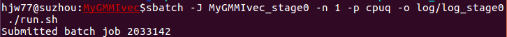

这里注意两个点：
1. 提交的是cpu队列，而不是gpu。
2. 建议每个stage运行后输出的log分开保存。（不然前面的会被后面覆盖掉）

跑完之后，可以看到工程目录下生成了一个文件夹data_plp，目录结构如下：

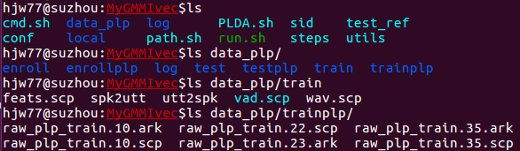

可以看到data_plp中包含7个文件夹：
> + 开发训练: train+trainplp
> + 注册: enroll+enrollplp
> + 测试: test+testplp
> + log文件夹: 存储plp特征提取的输出log信息。

具体以train+trainplp为例：
1. train: 这里的文件主要起到索引的作用。注意(f|m)XXX_ZZZ，即“说话人+文本”，是ivector的建模对象。
> + wav.scp： 即每个音频对应了哪个.wav文件的存储位置。
> + spk2utt： 即每个“说话人+文本”对应了哪9个音频。
> + utt2spk： 即每个音频对应了哪个“说话人+文本”。
> + feats.scp： 即每个音频提取后的plp特征存放的ark文件目录及第一个字节的偏移量。
> + vad.scp： 即每个音频对应的vad检测后的ark文件目录及第一个字节的偏移量。
2. trainplp:
> + raw_plp_train.X.scp： X（1～40）分成40个文件存储，作用与feats.scp相同
> + raw_plp_train.X.ark： X（1～40）与上相对应，具体plp特征存放的文件（二进制格式） 
（可使用copy-feats转化为文本格式查看，每个音频分成若干帧，每一帧提取出一个13维的plp特征向量）

### stage 1
#### 脚本解释
调用kaldi工具包训练UBM，分成三步：
1. 准备数据目录（传入开发集目录）
2. 先训练一个协方差矩阵为对角矩阵的UBM（40个并行任务，8个线程，512个高斯）
3. 在此基础上再训练一个协方差矩阵为全矩阵的UBM
#### 实验步骤和结果
同样需要先修改stage值控制只运行stage1，然后提交run.sh。

跑完之后，同样可以看到工程目录下生成了一个文件夹exp_plp，目录结构如下：

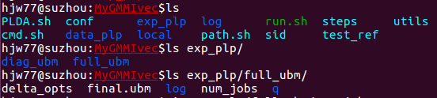

exp_plp/full_ubm/final.ubm将用于后续矩阵T的训练。

### stage 2
#### 脚本解释
直接调用kaldi工具包，训练得到ivector提取器（实际上就是矩阵T）。 
（40个并行任务，每个任务1个进程，每个进程1个线程，ivector维数为400，EM算法迭代5次，训练数据为开发集data_plp/train）

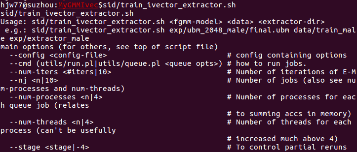

#### 实验步骤和结果
跑完之后，可以看到exp_plp目录下生成了文件夹extractor_train。

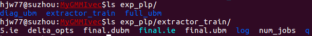

### stage 3
#### 脚本解释
利用stage 2中训练得到的ivector提取器，将data_plp中train,enroll和test的数据（plp提取的13维特征数据）提取转化为对应的ivector数据，依次存放在exp_plp/extrain/ivectors_train,exp_plp/extrain/ivectors_enroll和exp_plp/extrain/ivectors_test中。

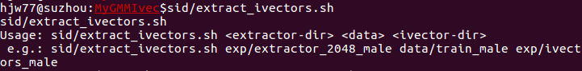

#### 实验步骤和结果
跑完之后，可以看到exp_plp目录下生成了文件夹extrain，将在最后的PLDA后端打分中使用。

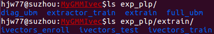

### PLDA.sh（stage 4）
#### 脚本解释
直接调用kaldi工具包，分成三步：
1. 训练PLDA模型，训练数据为开发集，调用ivector-compute-plda即可，用法为：

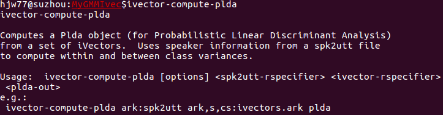

2. 利用训练好的PLDA模型给评测集进行打分，test_ref为给定的标准测试集合，ivector-plda-scoring用法为：

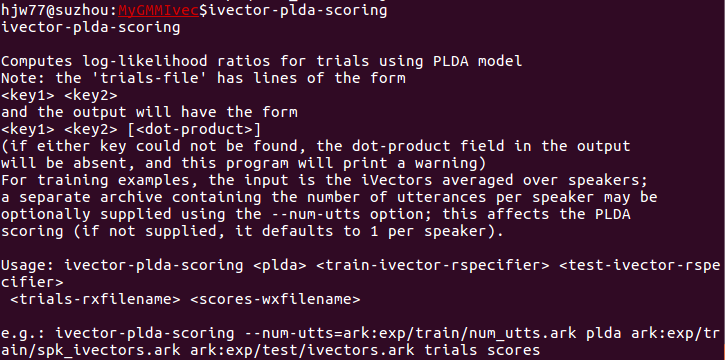

3. 根据打分结果计算EER，并保存到输出文件，调用compute-eer即可：

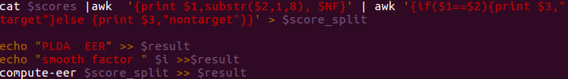

#### 实验步骤和结果
跑完之后，可以看到生成了results文件夹，包括单个子文件：
+ plda_score： plda给每个测试数据打分的结果。
+ plda_score_split： 根据注册和测试是否为同一个人得到每个score的标记（target or nontarget）
+ plda_result： 输出计算得到的EER（0.6089%）。

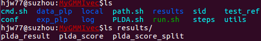

### 实验总结
这个实验的基本流程图为：

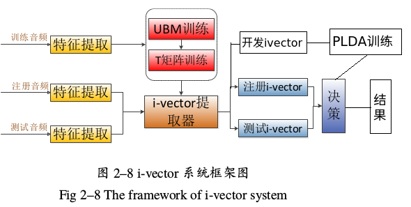

