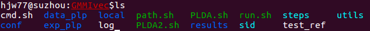
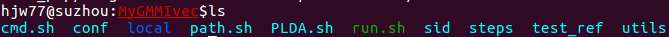
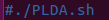
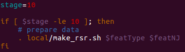

# GMMIvector 教程

## 开始之前
实验涉及到的理论部分大致有：
+ 数据准备：plp提取特征。
+ 训练ivector提取器：包括训练UBM，训练矩阵T。
+ ivector后端评分：PLDA

工具部分：
+ kaldi：上面提到的算法均是直接调用kaldi中封装好的接口，只有少数非核心代码（如数据准备，格式化输入）及整个实验流程的控制代码
（如引入了stage变量控制分步执行）是自己实现。

掌握以上知识，对理解数据格式和脚本代码有很大帮助。

## 实验部分
### 创建自己的实验目录
（苏州超算上）样例工程文件目录为：/mnt/lustre/sjtu/users/sw121/sid/tutorials/GMMIvec

由于每个人只对自己的工作目录有写权限，所以为了能够修改run.sh，然后分stage依次执行，首先应该在自己的工作目录下新建工程目录，如命名为MyGMMIvec,并将run.sh和local文件夹直接复制到工程目录下，然后将其余文件通过ln -s软链接到该目录下（除了data_plp,exp_plp,log和results,这四个文件将在后续分步执行过程中产生），若操作正确，工程目录如下：

之后，分步执行run.sh中每个stage，run.sh中共有5个stage（stage0～stage3，加上最后一行"./PLDA.sh"其实是stage4）。先注释掉最后一行"./PLDA.sh":

### stage 0
修改run.sh中stage的值为一个较大的值，如10,并将你将要运行的stage中的if语句判断条件中的数值修改为相同值（或更大）

### stage 1
实验 __完成__ 之后，完整的实验目录为：

