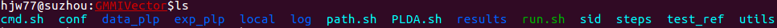

# GMMIvector 教程

## 开始之前
实验涉及到的理论部分大致有：
+ 数据准备：plp提取特征。
+ 训练ivector提取器：包括训练UBM，训练矩阵T。
+ ivector后端评分：PLDA

工具部分：
+ kaldi：上面提到的算法均是直接调用kaldi中封装好的接口，只有少数非核心代码（如数据准备，格式化输入）及整个实验流程的控制代码
（如引入了stage变量控制分步执行）是自己实现。

掌握以上知识，对理解数据格式和脚本代码有很大帮助。

## 实验部分
### 创建自己的实验目录
实验__完成__之后，完整的实验目录为：

### stage 0

### stage 1
